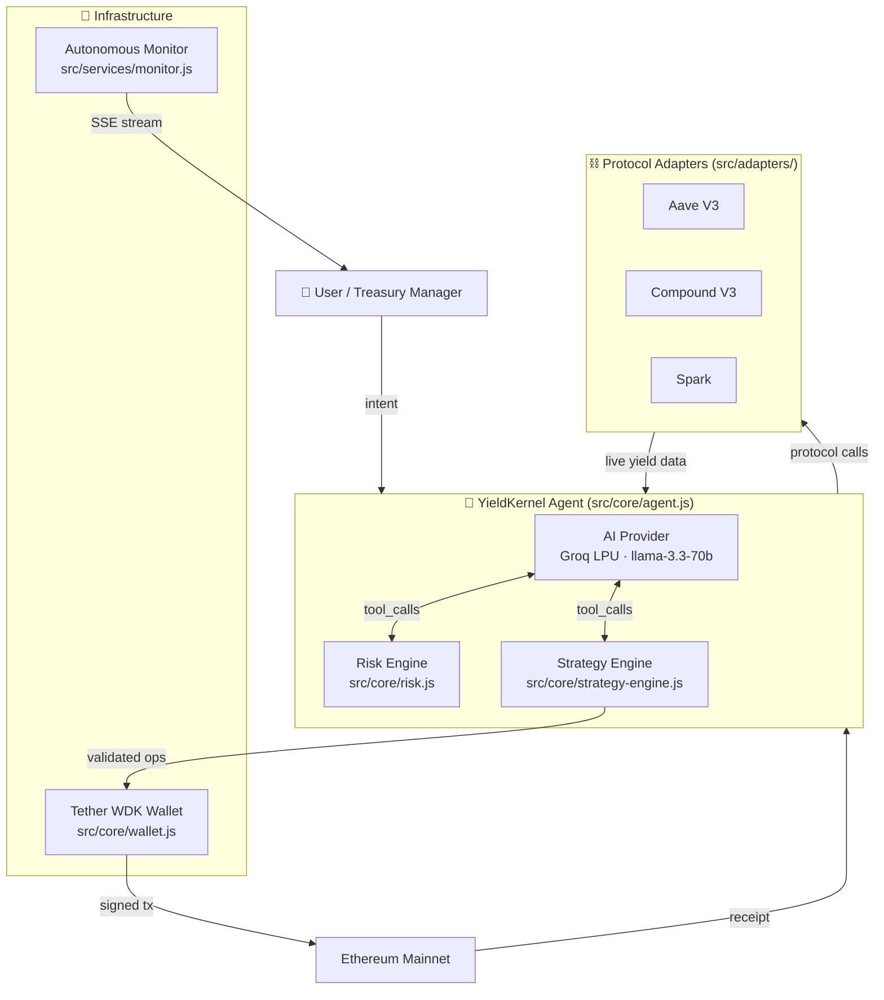
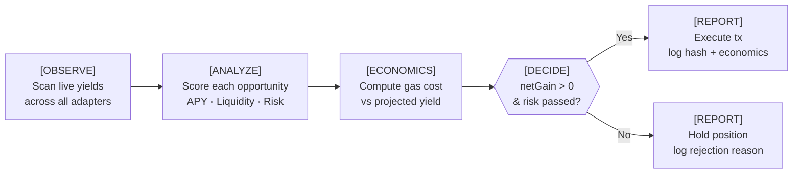
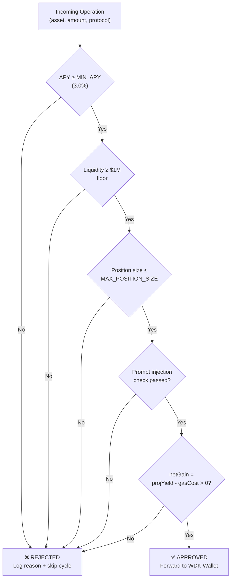
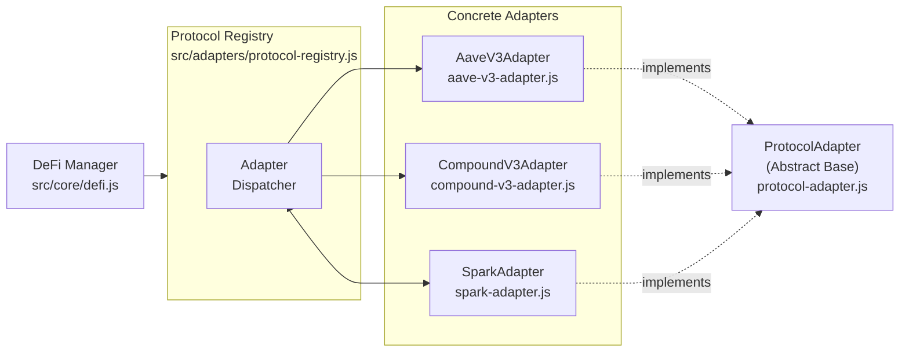

# YieldKernel: Institutional Autonomous DeFi Infrastructure

YieldKernel is a high-performance, self-custodial autonomous agent designed for institutional-grade DeFi yield optimization. Built on top of Tether's **Wallet Development Kit (WDK)** and powered by Groq's low-latency LPU inference, YieldKernel automates complex capital allocation across leading lending protocols while maintaining absolute user sovereignty.

Live Application: https://yieldkernel-app.web.app  
Backend API: https://yieldkernel-backend.onrender.com  
GitHub: https://github.com/juapperez/yield-kernel

Judge Mode (one-click transcript): `POST /api/judge/run`  
On-chain Proof TX (testnet): `POST /api/proof/tx`  
Autonomy Stream (SSE): `GET /api/monitor/stream`

Submission note: the DoraHacks listing requires a demo video for submission.

---

## Technical Architecture

YieldKernel follows a modular, industrial-strength architecture designed for reliability, security, and extensibility.

### System Overview



---

### Autonomous Decision Loop



---

### Risk Validation Pipeline



---

### Protocol Adapter Layer



---

## Core Components

| Module | Path | Responsibility |
|---|---|---|
| **agent.js** | `src/core/` | Central intelligence layer. Groq LPU + structured `tool_calls`. Runs the full `OBSERVE → ANALYZE → ECONOMICS → DECIDE → REPORT` loop. |
| **ai-provider.js** | `src/core/` | Pluggable AI backend. Configured for Groq `llama-3.3-70b-versatile` with `tool_choice: auto`. |
| **defi.js** | `src/core/` | Unified DeFi abstraction. Delegates to adapters for supply, withdraw, and yield discovery. |
| **risk.js** | `src/core/` | Lightweight risk gate. Entry point for APY, liquidity, and size checks. |
| **risk-engine.js** | `src/core/` | Deep multi-layer validation engine. Covers prompt injection, gas economics, and protocol scoring. |
| **strategy-engine.js** | `src/core/` | Generates and ranks allocation strategies across protocols based on risk-adjusted return. |
| **wallet.js** | `src/core/` | Tether WDK integration. Self-custodial key management, mnemonic storage, and tx signing. |
| **monitor.js** | `src/services/` | 24/7 autonomous background monitor. Streams structured decisions via SSE every 30 seconds. |
| **aave-v3-adapter.js** | `src/adapters/` | Aave V3 protocol adapter. Supply, withdraw, getYields on Ethereum Mainnet. |
| **compound-v3-adapter.js** | `src/adapters/` | Compound V3 adapter. Comet contract integration for USDC/ETH markets. |
| **spark-adapter.js** | `src/adapters/` | Spark (MakerDAO fork) adapter. DAI/USDS yield markets. |
| **protocol-registry.js** | `src/adapters/` | Dynamic adapter registry. Resolves and dispatches to the correct protocol adapter at runtime. |

---

## Economic Soundness

- **Asset Focus:** USD₮ (USDT) and institutional stablecoins — liquid, low-slippage, and audited
- **Gas vs Yield Gate:** Every operation checks `netGain = projectedYield - gasCost`. Rejected if negative.
- **Risk-Adjusted Scoring:** Each protocol scored 0–100 based on TVL, audit history, and liquidity depth
- **Position Safety:** `MAX_POSITION_SIZE=1000 USDT` prevents over-exposure. `MIN_APY=3.0%` prevents yield-chasing below risk threshold.
- **Tx Economics Example:** Supply 1000 USDT @ 3.45% APY = $34.50/yr yield, $13.75 gas = **$20.75 net annual gain**

---

## Real-World Applicability

- **Self-Custodial:** Built on Tether WDK — users control private keys, agents only act within defined constraints
- **Deployable Today:** Uses production Aave V3 contract addresses on Ethereum Mainnet
- **Multi-Protocol:** Actively routes across Aave V3, Compound V3, and Spark for best risk-adjusted yield
- **Target Users:** DAO treasuries, family offices, and power users automating DeFi exposure without custodial risk

---

## Getting Started

### Prerequisites
- Node.js v18+
- Groq API Key

### Installation
```bash
git clone https://github.com/juapperez/yield-kernel.git
cd yield-kernel
npm install
cp .env.example .env
# Set GROQ_API_KEY in .env
```

### Run Locally
```bash
npm run web
# Open http://localhost:3000
```

### Environment Variables
```env
GROQ_API_KEY=<your_groq_key>
AI_PROVIDER=groq
MAX_POSITION_SIZE_USDT=1000
MIN_APY_THRESHOLD=3.0
RPC_URL=https://eth.llamarpc.com
CHAIN_ID=1
```

---

**YieldKernel** — *Autonomous Intelligence. Absolute Sovereignty.*
